# Real-Time Log Analytics with Confluent, Dremio & Apache Iceberg

This workshop demonstrates a real-time log analytics pipeline that streams Kubernetes logs into a queryable data lakehouse. The architecture combines Confluent Platform for streaming, Apache Iceberg for table format, and Dremio for SQL analytics - all deployed on Kubernetes using GitOps principles with ArgoCD.

**What You'll Build**: A complete pipeline that captures every log from your Kubernetes cluster, streams it through Kafka, transforms it into Iceberg tables, and makes it instantly queryable through Dremio's SQL interface - enabling real-time log analytics, troubleshooting, and observability at scale.

## Architecture Overview

The workshop sets up the following components:

- **Confluent Platform**: Full Kafka ecosystem with KRaft controllers, Schema Registry, Connect, ksqlDB, and Control Center
- **Dremio**: Data lakehouse platform with Iceberg catalog support
- **Apache Iceberg**: Table format for data lakes with Kafka Connect integration
- **Fluent Bit**: Log aggregation and forwarding to Kafka
- **MinIO**: S3-compatible object storage for Iceberg tables
- **ArgoCD**: GitOps continuous deployment
- **Prometheus Stack**: Monitoring and observability

### Data Flow Pipeline

The workshop implements a complete log analytics pipeline with the following data flow:

```mermaid
graph TB
    subgraph k8s["Kubernetes Cluster"]
        pods["Pod Logs<br/>(stdout/stderr)<br/>All Namespaces"]

        subgraph fluent["Log Collection Layer"]
            fb["Fluent Bit<br/>(DaemonSet)<br/>Collects & enriches logs<br/>with K8s metadata"]
        end

        subgraph confluent["Confluent Platform"]
            kafka["Kafka Brokers (3 nodes)<br/>📨 Topic: fluent-bit<br/>⏱️ Retention: 1h / 500MB<br/>🔒 SASL_SSL encrypted"]
            connect["Kafka Connect (3 workers)<br/>🔌 Iceberg Sink Connector<br/>⚙️ Batch commits every 60s"]
        end

        subgraph dremio["Dremio Platform"]
            catalog["Dremio Catalog Services<br/>📋 REST Catalog API<br/>🔐 OAuth2 authentication<br/>📊 Table: fluent_bit.logs"]
            coordinator["Dremio Coordinator + Executors<br/>🔍 SQL Query Engine<br/>⏮️ Time travel queries<br/>📈 Real-time analytics"]
        end

        subgraph storage["Object Storage"]
            minio["MinIO (S3-compatible)<br/>🗄️ Bucket: dremio<br/>📦 Parquet data files<br/>📝 Iceberg metadata"]
        end
    end

    pods ==>|"JSON logs with<br/>K8s metadata"| fb
    fb ==>|"Streaming events<br/>(encrypted)"| kafka
    kafka ==>|"Consume from<br/>fluent-bit topic"| connect
    connect ==>|"Iceberg write ops<br/>(REST API)"| catalog
    catalog ==>|"Parquet files +<br/>metadata"| minio
    minio -.->|"Read Iceberg<br/>tables"| coordinator

    style pods fill:#e1f5ff,stroke:#0288d1,stroke-width:2px,color:#000
    style fb fill:#fff3e0,stroke:#f57c00,stroke-width:2px,color:#000
    style kafka fill:#f3e5f5,stroke:#7b1fa2,stroke-width:2px,color:#000
    style connect fill:#f3e5f5,stroke:#7b1fa2,stroke-width:2px,color:#000
    style catalog fill:#e8f5e9,stroke:#388e3c,stroke-width:2px,color:#000
    style coordinator fill:#e8f5e9,stroke:#388e3c,stroke-width:2px,color:#000
    style minio fill:#fce4ec,stroke:#c2185b,stroke-width:2px,color:#000

    style k8s fill:none,stroke:#424242,stroke-width:3px,color:#000
    style fluent fill:none,stroke:#f57c00,stroke-width:2px,stroke-dasharray: 5 5,color:#000
    style confluent fill:none,stroke:#7b1fa2,stroke-width:2px,stroke-dasharray: 5 5,color:#000
    style dremio fill:none,stroke:#388e3c,stroke-width:2px,stroke-dasharray: 5 5,color:#000
    style storage fill:none,stroke:#c2185b,stroke-width:2px,stroke-dasharray: 5 5,color:#000
```



#### Pipeline Stages Explained

1. **Log Collection (Fluent Bit)**
   - Deployed as a DaemonSet on every Kubernetes node
   - Automatically discovers and tails logs from all pods
   - Enriches logs with Kubernetes metadata (namespace, pod name, labels, etc.)
   - Formats logs as JSON for structured processing

2. **Stream Buffering (Kafka)**
   - Receives logs on the `fluent-bit` topic
   - Provides durability and replay capability (1-hour retention)
   - Enables decoupling between log collection and processing
   - Handles backpressure and ensures no log loss

3. **Lakehouse Integration (Iceberg Sink Connector)**
   - Consumes logs from Kafka in micro-batches
   - Automatically creates the `fluent_bit.logs` Iceberg table
   - Converts JSON logs to Parquet format for efficient storage
   - Commits data every 60 seconds for near-real-time availability
   - Handles schema evolution as log formats change

4. **Catalog Management (Dremio Catalog Services)**
   - Provides REST Catalog API for Iceberg operations
   - Manages table metadata, snapshots, and schema versions
   - Authenticates connector via OAuth2 with Personal Access Token
   - Coordinates concurrent writes and maintains ACID guarantees

5. **Object Storage (MinIO)**
   - Stores Iceberg data files in Parquet format
   - Stores Iceberg metadata files (manifests, snapshots)
   - Provides S3-compatible API for seamless integration
   - Enables cost-effective, scalable storage

6. **Analytics Layer (Dremio)**
   - Queries Iceberg tables directly from MinIO
   - Provides SQL interface for log analysis
   - Supports time travel to query historical snapshots
   - Enables joins with other data sources
   - Powers dashboards and visualizations

#### Key Benefits of This Architecture

- **Real-time**: Logs queryable within ~60 seconds of generation
- **Scalable**: Handles high log volumes with Kafka buffering
- **Cost-effective**: Parquet compression + object storage
- **ACID compliant**: Iceberg ensures data consistency
- **Time travel**: Query logs from any point in time
- **Schema evolution**: Adapts to changing log formats
- **SQL-friendly**: Standard SQL for log analysis
- **Decoupled**: Each component can scale independently

## Prerequisites

### Required Software

1. **Kubernetes Cluster**
   - Docker Desktop with Kubernetes enabled, or
   - Minikube, Kind, or any other local Kubernetes cluster
   - Minimum resources: 8 CPU cores, 16GB RAM

2. **Command Line Tools**
   - `kubectl` - Kubernetes CLI
   - `helm` - Kubernetes package manager (v3+)
   - `openssl` - For generating TLS certificates
   - `git` - For cloning repositories
   - `k9s` (**Optional**, but I highly recommend it) - Kubernetes CLI with a terminal UI

3. **For Building Iceberg Connector** (Optional - pre-built connector is available)
   - Java 17 or 21 (JDK)
   - Maven
   - `unzip` and `zip` utilities

4. **Dremio Credentials**
   - Dremio license key
   - Dremio Quay.io pull secret (for container images)

### System Requirements

- **CPU**: 8+ cores recommended
- **Memory**: 16GB+ RAM
- **Disk**: 50GB+ free space
- **Network**: Internet access for pulling container images

## Setup Instructions

### Step 1: Configure Kubernetes Context

Ensure your `kubectl` is configured to point to your Kubernetes cluster:

```bash
kubectl config current-context
kubectl cluster-info
```

Update the `KUBECONFIG` path in `run.sh` if needed (line 19):
```bash
export KUBECONFIG=/path/to/your/.kube/config
```

### Step 2: Configure Dremio Secrets

Edit `dremio-secrets.yaml` and replace the placeholder values:

1. **Docker Pull Secret**: Get your Dremio Quay.io credentials and set the `<YOUR_BASE64_ENCODED_DOCKER_CONFIG_JSON>` value.
2. **Dremio License**: Replace `<YOUR_DREMIO_LICENSE_KEY>` with your actual license key.

### Step 3: Build Iceberg Kafka Connector (Optional)

**Note**: A pre-built connector is already configured and will be automatically downloaded by Kafka Connect. You only need to build the connector yourself if you want to:
- Use a different version of Apache Iceberg
- Customize the connector
- Use a different version of Dremio Auth Manager

#### Prerequisites for Building

- **Java**: JDK 17, or 21 (the script defaults to JDK 21)
- **Maven**: For downloading dependencies
- **Build tools**: `git`, `unzip`, `zip`

#### Building the Connector

Run the build script:

```bash
./build-iceberg-kafka-connector.sh
```

The script performs the following steps:

1. **Clones Apache Iceberg**
   - Creates a working directory: `./iceberg-kafka-connector-build/`
   - Clones from: `https://github.com/apache/iceberg.git`
   - Optional: Uncomment line 35 to checkout a specific release tag

2. **Builds Iceberg Kafka Connect Runtime**
   - Uses Gradle to build only the Kafka Connect module
   - Skips tests for faster build (typically 5-10 minutes)
   - Output: `iceberg-kafka-connect-runtime-*.zip`

3. **Downloads Dremio Auth Manager**
   - Version: `0.1.3` (configurable via `AUTHMGR_VERSION` variable)
   - Downloads from Maven Central: `com.dremio.iceberg.authmgr:authmgr-oauth2-runtime`
   - Stored in: `~/.m2/repository/`

4. **Bundles Components**
   - Extracts the Iceberg connector ZIP
   - Adds the Auth Manager JAR to the `lib/` directory
   - Re-packages into: `iceberg-kafka-connect-with-authmgr-0.1.3.zip`

5. **Outputs Build Information**
   - Final ZIP location: `./iceberg-kafka-connector-build/iceberg-kafka-connect-with-authmgr-0.1.3.zip`
   - SHA-512 checksum for verification
   - Confirms Auth Manager JAR is included

#### Using Your Custom Build

After building, you need to make the connector available to Kafka Connect:

1. **Upload the ZIP file** to a location accessible from your Kubernetes cluster:
   ```bash
   # Example: Upload to S3
   aws s3 cp ./iceberg-kafka-connector-build/iceberg-kafka-connect-with-authmgr-0.1.3.zip \
     s3://your-bucket/connectors/

   # Get the public URL
   aws s3 presign s3://your-bucket/connectors/iceberg-kafka-connect-with-authmgr-0.1.3.zip
   ```
   
   **Important Note:** Your uploaded ZIP file URL must end with `.zip` for Confluent Kafka Connect to recognize it as a plugin archive.

2. **Update the connector configuration** in `charts/confluent-resources/templates/confluent-platform-quick.yaml`:
   ```yaml
   # Around line 170-173
   build:
     type: onDemand
     onDemand:
       plugins:
         url:
           - archivePath: https://your-url/iceberg-kafka-connect-with-authmgr-0.1.3.zip
             checksum: <your-sha512-checksum>
             name: iceberg-kafka-connect-with-authmgr-0.1.3
   ```

3. **Commit and push** the changes - ArgoCD will automatically sync and redeploy Kafka Connect with your custom connector.

#### Troubleshooting Build Issues

**Java version errors**:
```bash
# Check Java version
java -version

# On macOS, list available Java versions
/usr/libexec/java_home -V

# Set JAVA_HOME manually before running script
export JAVA_HOME=$(/usr/libexec/java_home -v 21)
```

**Gradle build failures**:
- Ensure you have sufficient memory (4GB+ recommended)
- Check internet connection for downloading dependencies
- Try cleaning the build: `cd iceberg-kafka-connector-build/iceberg && ./gradlew clean`

**Maven download failures**:
- Verify Maven is installed: `mvn --version`
- Check Maven Central is accessible
- Clear Maven cache: `rm -rf ~/.m2/repository/com/dremio/iceberg/authmgr/`

**Note**: The connector is already pre-built and hosted at the URL specified in `charts/confluent-resources/templates/confluent-platform-quick.yaml`. You only need to build it if you want to use a different version or customize it.

If you build your own connector:
1. Upload the ZIP file to an accessible URL (S3, HTTP server, etc.)
2. Update the connector URL and checksum in `charts/confluent-resources/templates/confluent-platform-quick.yaml` (lines 171-172)

### Step 4: Deploy the Stack

Run the main deployment script:

```bash
./run.sh
```

This script will:
1. Generate TLS certificates for Confluent Platform (optional, you can use the provided self-signed certs)
2. Create the `argocd` namespace
3. Install ArgoCD using Helm
4. Wait 60 seconds for ArgoCD to be ready and dremio namespace to be created (adjust as needed)
5. Apply Dremio secrets

### Step 5: Monitor Deployment

Watch the ArgoCD applications sync:

```bash
# Get ArgoCD admin password
kubectl -n argocd get secret argocd-initial-admin-secret -o jsonpath="{.data.password}" | base64 -d

# Port-forward to ArgoCD UI
kubectl port-forward svc/argocd-server -n argocd 8080:443

# Access ArgoCD at https://localhost:8080
# Username: admin
# Password: (from command above)
```

Monitor pod status:

```bash
# Watch all namespaces
watch kubectl get pods -A

# Check specific namespaces
kubectl get pods -n confluent
kubectl get pods -n dremio
kubectl get pods -n fluent-bit
kubectl get pods -n monitoring
```

## Post-Deployment Configuration

### 1. Generate Dremio Personal Access Token

1. Access Dremio UI at `http://localhost:9047`
2. Login with default credentials (dremio/dremio123)
3. Go to User Settings → Personal Access Tokens
4. Generate a new token
5. Update the token in `charts/confluent-resources/templates/connectors.yaml`:
   ```yaml
   iceberg.catalog.rest.auth.oauth2.token-exchange.subject-token: "<YOUR_PAT_TOKEN>"
   ```
6. Commit and push changes (ArgoCD will auto-sync, or you can manually sync)

### 2. Create Dremio Source for MinIO

1. In Dremio UI, add a new S3 source:
   - **Name**: `dremio-warehouse`
   - **Access Key**: `minio`
   - **Secret Key**: `minio123`
   - **Root Path**: `/dremio/catalog`
   - **Connection Properties**:
     - `fs.s3a.endpoint`: `minio.dremio.svc.cluster.local:9000`
     - `fs.s3a.path.style.access`: `true`
     - `dremio.s3.compat`: `true`
     - `fs.s3a.connection.ssl.enabled`: `false`

### 3. Verify Data Flow

Check that logs are flowing through the pipeline:

```bash
# Check Kafka topic has messages
kubectl port-forward svc/controlcenter -n confluent 9021:9021
# Access Control Center at http://localhost:9021
# Login with default credentials (kafka/kafka-secret)
# Check "Topics" and verify "fluent-bit" has messages

# Check connector status
kubectl get connector -n confluent
kubectl describe connector fluent-bit-dremio-sink -n confluent

# Query data in Dremio
# In Dremio UI, run:
# SELECT * FROM fluent_bit.logs LIMIT 10;
```


## Component Details

### Confluent Platform

**Namespace**: `confluent`

**Components**:
- **KRaft Controllers**: 3 replicas for metadata management
- **Kafka Brokers**: 3 replicas with internal and external listeners
- **Schema Registry**: 1 replica
- **Kafka Connect**: 3 replicas with Iceberg connector pre-installed
- **ksqlDB**: 1 replica for stream processing
- **Control Center**: 1 replica for management UI
- **Kafka REST Proxy**: 1 replica

**Access**:
```bash
# Control Center UI
kubectl port-forward svc/controlcenter -n confluent 9021:9021
# Access at http://localhost:9021

# External Kafka access (NodePort)
# Brokers available at localhost:30000, localhost:30001, localhost:30002
```

**Authentication**:
- RBAC enabled with MDS (Metadata Service)
- TLS enabled on all listeners
- Credentials stored in secrets (check `charts/confluent-resources/templates/users-secret.yaml`)

### Dremio

**Namespace**: `dremio`

**Components**:
- **Coordinator**: 1 replica (2 CPU, 4Gi memory)
- **Executor**: Elastic engines (configurable)
- **Catalog Services**: 1 replica for Iceberg catalog
- **MongoDB**: 1 replica for metadata storage
- **Zookeeper**: 1 replica for coordination
- **NATS**: 3 replicas for messaging
- **MinIO**: Standalone mode for S3-compatible storage

**Access**:
```bash
# Dremio UI
kubectl port-forward svc/dremio-client -n dremio 9047:9047
# Access at http://localhost:9047

# Default credentials (since we set debug.addDefaultUser=true)
# Username: dremio
# Password: dremio123
```

**Storage**:
- **Distributed Storage**: MinIO bucket `dremio` at `s3://dremio/`
- **Catalog Storage**: MinIO bucket `dremio` at `s3://dremio/catalog`

### Fluent Bit

**Namespace**: `fluent-bit`

Fluent Bit collects logs from all Kubernetes pods and forwards them to Kafka topic `fluent-bit`.

**Configuration**:
- Output: Kafka broker at `kafka.confluent.svc.cluster.local:9071`
- Topic: `fluent-bit`
- Authentication: SASL_SSL with username `fluent-bit-user`

### Iceberg Sink Connector

The connector reads from the `fluent-bit` Kafka topic and writes to Iceberg tables in Dremio.

**Configuration**:
- **Connector Class**: `org.apache.iceberg.connect.IcebergSinkConnector`
- **Source Topic**: `fluent-bit`
- **Target Table**: `fluent_bit.logs`
- **Catalog Type**: REST (Dremio Catalog API)
- **Catalog URI**: `http://dremio-client.dremio.svc.cluster.local:8181/api/catalog`
- **Authentication**: OAuth2 with Dremio Personal Access Token


## Troubleshooting

### Dremio Issues

```bash
# Check coordinator logs
kubectl logs -n dremio dremio-master-0

# Check catalog services
kubectl logs -n dremio -l app=dremio-catalog-services

# Check MinIO
kubectl logs -n dremio -l app=minio
```

### Connector Issues

```bash
# Check connector status
kubectl get connector -n confluent fluent-bit-dremio-sink -o yaml

# View connector logs (in Connect pod)
kubectl logs -n confluent connect-0 | grep iceberg

# Restart connector
kubectl delete connector fluent-bit-dremio-sink -n confluent
# ArgoCD will recreate it
```

### Common Issues

1. **Pods stuck in Pending**: Check resource availability
   ```bash
   kubectl describe pod <pod-name> -n <namespace>
   ```

2. **ImagePullBackOff for Dremio**: Verify pull secret is correct
   ```bash
   kubectl get secret dremio-pull-secret -n dremio -o yaml
   ```

3. **Connector fails to authenticate**: Verify Dremio PAT token is valid and has correct permissions

4. **No data in Iceberg tables**: Check Fluent Bit is sending to Kafka, and connector is running

## Useful Resources

- [Dremio Documentation](https://docs.dremio.com/)
- [Confluent Platform Documentation](https://docs.confluent.io/)
- [Apache Iceberg Sink Connector](https://iceberg.apache.org/docs/nightly/kafka-connect/#apache-iceberg-sink-connector)
- [Fluent Bit Documentation](https://docs.fluentbit.io/)
- [ArgoCD Documentation](https://argo-cd.readthedocs.io/)
